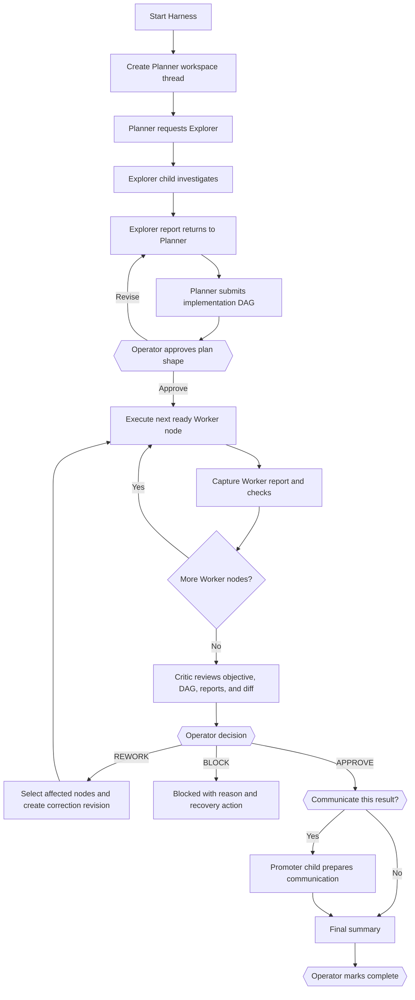
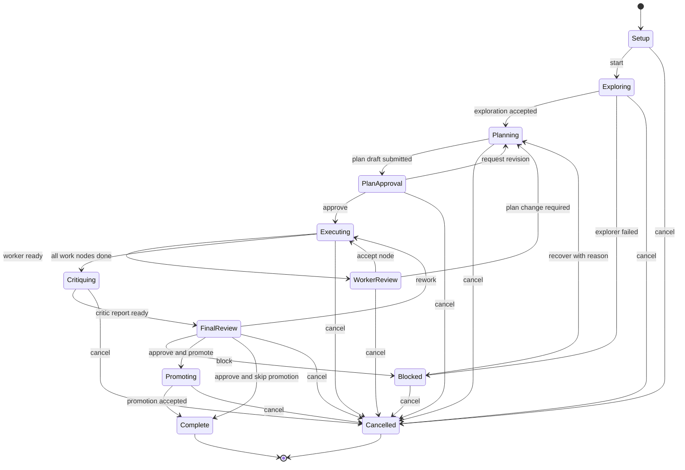

# Article-aligned BB Harness redesign

Status: proposed implementation plan
Release target: `v0.2.0` (the existing v0.2 work is not published)
Persistence target: schema v3, append-only migration from v0.1/v2 data
Source: [The Harness Is the Thing](https://scott-fryxell.github.io/blog/the-harness-is-the-thing/) and [scott-fryxell/brayness](https://github.com/scott-fryxell/brayness)

## 1. Objective

Turn the current Harness plugin from a five-node phase tracker into a complete BB-native harness orchestration layer that:

- treats BB, its providers, project instructions, skills, scripts, environments, and visible threads as the harness substrate;
- keeps Planner as the durable orchestrator and gives Explorer, Workers, Critic, and optional Promoter isolated role threads;
- converts exploration into an operator-approved implementation DAG;
- passes versioned, explicit context packets between roles;
- executes the actual DAG rather than a seeded `explore -> plan -> worker -> critic -> promote` pseudo-DAG;
- allows provider/model/reasoning/service-tier defaults per role and pending-node overrides;
- keeps the human as the authority at plan, rework, block, promotion, cancellation, and completion gates;
- keeps detailed provenance available without making the operator manage database concepts;
- is recoverable after reloads, provider failures, stale UI, and partial child creation;
- is unit-, integration-, frontend-, and manually testable.

“100% implemented” means every acceptance criterion in this document passes and no known P0/P1 defect remains. It cannot mean a mathematical guarantee that no future provider, SDK, or model failure is possible.

## 2. Product definition

### 2.1 What the product is

Harness is an opt-in BB orchestration mode for complex work. BB remains the underlying harness:

- BB project/environment: workspace and execution boundary;
- BB `AGENTS.md` and installed skills: shared working knowledge;
- BB providers: interchangeable role runtimes;
- BB child threads: role isolation and visible audit trail;
- project scripts and agent tools: deterministic execution capabilities;
- Harness plugin: role routing, context delivery, gates, DAG state, and recovery.

The plugin should be described as **Harness for BB**, while its concrete feature is the **Harness Arc**.

### 2.2 When it should be used

Use Harness for branchy, risky, creative, or multi-step work where exploration, an explicit plan, independent review, or model specialization will repay the ceremony.

Do not recommend it for trivial edits. The inactive panel should say that ordinary BB chat is the correct path for small, clear work.

### 2.3 Article concepts mapped into BB

| Article concept | BB implementation |
| --- | --- |
| Shared harness across models | One BB plugin using any provider/model available in the target environment |
| `AGENTS.md` | BB’s existing user/workspace instruction injection; do not duplicate it |
| Skills | BB’s existing skill catalog; Harness records optional skill hints and validates discoverability |
| Extensions/tools | BB plugin tools plus provider tools already available to each thread |
| Scripts/product drivers | Project scripts and files used by role agents; Harness records recommended verification commands |
| `artifacts/` | Versioned task packets, plans, role reports, decisions, and export manifest under the workspace |
| Planner/Worker/Critic split | Isolated BB role threads with distinct prompts and model routing |
| Prewalk | A true context-preserving model handoff only if BB exposes safe same-session switching; otherwise call it first/later Worker routing |
| Promoter | Optional communication phase, never mandatory for routine maintenance |
| Human agency | Explicit plan approval, Critic decision, rework scope, promotion choice, and final completion |

## 3. Target user experience

### 3.1 Primary flow



### 3.2 What the operator sees

One Harness panel, with one obvious primary action at a time:

1. **Setup** — task, preset, role routing preview, artifact location.
2. **Exploring** — Explorer thread, live status, Open/Stop/Retry.
3. **Planning** — embedded Planner chat and draft DAG.
4. **Plan approval** — readable nodes, dependencies, acceptance checks, Edit/Approve.
5. **Building** — `n/m` tasks complete, active Worker, next ready task.
6. **Review** — Critic findings and Approve/Rework/Block.
7. **Share** — Start Promoter or Skip.
8. **Done** — result, checks, artifacts, provider usage, and links.

The primary panel must not expose plan revisions, mutation IDs, output hashes, or lifecycle internals. Those belong in a collapsed **Audit details** section.

### 3.3 Planner as orchestrator

The original thread is the run’s control/home surface. Harness creates a dedicated visible Planner thread using the configured Planner provider. The panel embeds that conversation with BB’s `ThreadChat`, so the Planner feels like the main working conversation without requiring navigation.

The Planner receives only orchestration tools. Its first exploration tool call:

1. spawns the configured Explorer as a child of Planner;
2. waits for Explorer to become idle/failed;
3. captures the output and structured report;
4. stores the report and returns it into the Planner’s current context.

This gives Planner the Explorer’s result directly while preserving provider isolation.

If a provider cannot reliably perform the required tool call, the panel offers a deterministic **Run Explorer** action; Planner planning remains unavailable until exploration is accepted or explicitly skipped with a reason.

## 4. Core design corrections

### 4.1 Separate the arc from the implementation DAG

The arc is run lifecycle state. The DAG contains implementation tasks only.

Remove phase nodes such as `explore`, `plan`, `critic`, and `promote` from new plans. New DAG nodes have a task role, normally `worker`:

```ts
type WorkNode = {
  id: string;
  title: string;
  objective: string;
  dependencies: string[];
  acceptanceCriteria: string[];
  verificationCommands: string[];
  expectedArtifacts: string[];
  skillHints: string[];
  status: "pending" | "ready" | "running" | "awaiting_review" | "done" | "failed" | "invalidated" | "skipped";
  planRevision: number;
  attemptId: string | null;
  routingOverride: ExecutionChoice | null;
};
```

The engine computes ready nodes topologically. Critic cannot start until every required Worker node is done. Rework invalidates the selected nodes and any downstream nodes whose inputs are no longer trustworthy.

### 4.2 Make the active plan the Planner’s output

Replace `harness_create_plan` with two tools:

- `harness_submit_plan_draft` — creates or replaces the active run’s proposed DAG;
- `harness_update_plan_draft` — applies a validated revision before approval.

Neither tool can approve the plan. Operator approval snapshots the DAG as revision 1 and starts execution.

The current behavior that creates a detached archived plan must be removed for new runs. Legacy `plan create` remains read-only/deprecated for one release.

### 4.3 Introduce a versioned task packet

Every role receives a bounded JSON/Markdown packet generated from authoritative database state:

```ts
type TaskPacket = {
  schemaVersion: 1;
  runId: string;
  packetVersion: number;
  objective: string;
  project: { id: string; name: string; environmentId: string; workspacePath: string };
  constraints: string[];
  exploration: RoleReport | null;
  approvedPlan: { revision: number; nodes: WorkNode[] } | null;
  currentNode: WorkNode | null;
  dependencyResults: NodeResult[];
  decisions: Decision[];
  artifactIndex: ArtifactRef[];
  verificationSummary: VerificationResult[];
};
```

Role-specific packet slices:

- Explorer: objective, constraints, project context, requested questions.
- Planner: objective, Explorer report, project commands/tooling, prior decisions.
- Worker: objective, full approved plan outline, current node, dependencies, acceptance criteria, verification commands, relevant artifacts.
- Critic: objective, approved plan, all Worker reports, verification results, environment diff summary, unresolved risks.
- Promoter: verified result, audience/channel, approved claims, artifacts, known limitations.

Packets are bounded before insertion into prompts. Large reports are written to artifacts and represented by links plus concise summaries.

### 4.4 Structured role reports

Register child-only submission tools:

- `harness_submit_exploration`
- `harness_submit_worker_report`
- `harness_submit_critic_report`
- `harness_submit_promotion`

Each tool validates a role-specific schema and can mutate only the caller’s current attempt. Idle output remains a fallback, not the preferred data contract.

A Worker report includes:

- outcome: complete / blocked / plan-change-needed;
- summary;
- changed files;
- acceptance-criterion results;
- commands run and exit outcomes;
- artifact references;
- remaining risks.

A Critic report includes:

- recommendation: APPROVE / REWORK / BLOCK;
- severity-ranked findings;
- affected node IDs;
- deterministic checks independently rerun;
- unsupported claims;
- remaining risks.

The agent recommends. Only the operator records the final decision.

## 5. Role routing and presets

### 5.1 Saved presets

Replace hard-coded global defaults with saved **Role Presets**. Fresh installs default every role to inherit. Preserve the current user’s configured mapping as a migrated preset rather than deleting it.

A preset contains:

```ts
type RolePreset = {
  id: string;
  name: string;
  scope: "global" | "project";
  projectId: string | null;
  roles: {
    explorer: RoleExecution;
    planner: RoleExecution;
    workerFirst: RoleExecution;
    workerRest: RoleExecution;
    critic: RoleExecution;
    promoter: RoleExecution;
  };
  promotionMode: "ask" | "off" | "always";
  artifactPolicy: "advisory" | "required";
};

type RoleExecution = {
  choice: ExecutionChoice | null;
  permissionMode: "accept-edits" | "auto" | null;
  skillHints: string[];
};
```

### 5.2 Runtime guarantees

- Route all roles through dedicated threads so configured provider IDs are actually honored.
- Use BB’s `experimental_ProviderModelPicker` with environment routing.
- Use `experimental_PermissionModePicker`; never widen beyond parent/machine policy.
- Validate provider availability at Start. A stale model blocks Start with a direct repair control.
- Snapshot the preset into the run. Later settings edits affect future runs only.
- Allow pending-node model overrides from the run panel; lock after claim.
- Show source labels: preset, node override, or inherited.
- Never describe routing as provider-neutral if a selected provider is unavailable.

### 5.3 Prewalk terminology

Do not claim prewalk for separate child threads.

For v0.2:

- label the split **First Worker / Later Workers**;
- explain that it approximates model specialization but starts fresh contexts;
- add a capability spike for true same-session model switching;
- expose “Prewalk” only after a live proof shows BB can safely change model/provider without losing provider conversation semantics.

## 6. BB-native skills, instructions, scripts, and artifacts

### 6.1 Instructions

Do not copy workspace `AGENTS.md` into packets. BB already injects it. Prompts state that workspace instructions remain authoritative.

Harness-specific prompts should be concise role contracts, generated from tested templates in a dedicated module.

### 6.2 Skills

The plugin SDK can dynamically select only this plugin’s own registered skills through `bb.agents.configure`; it cannot force-enable another plugin’s skill. Therefore:

- keep bundled role skills small: `harness-planner`, `harness-worker`, `harness-critic`, `harness-promoter`;
- allow preset/node `skillHints` referencing BB-discovered project/user skills;
- validate hints with `bb.sdk.skills.list` and show unresolved warnings;
- place skill hints in the task packet as requested capabilities, without claiming guaranteed activation;
- never present arbitrary cross-plugin skill selection as a security boundary or tool allowlist.

### 6.3 Scripts and deterministic verification

- Ask Planner to record task-specific verification commands on each node.
- Discover project commands with `bb.sdk.projects.commands` where available.
- Workers run commands through their normal agent tools; Harness records the claims and artifacts.
- Critic independently reruns the cheapest relevant checks.
- A future direct script runner is out of scope unless BB exposes an execution API with an explicit permission boundary; do not smuggle shell execution into the server plugin.

### 6.4 Workspace artifacts

For each run:

```text
artifacts/harness/<run-id>/
  task-packet.json
  exploration.md
  plan.md
  nodes/<node-id>/worker-report.md
  critic.md
  promotion.md             # only if run
  manifest.json
```

- Database state remains authoritative for recovery.
- Files are human-readable exports and context handoff assets.
- All file operations use `bb.sdk.files` with environment-derived `hostId`, `path`, and `rootPath`.
- Writes use compare-and-swap where an existing artifact may be revised.
- Artifact references must stay below `artifacts/` and reject traversal, absolute paths, URLs, and malformed Unicode.
- `plan.md` includes a Mermaid DAG plus a compact node/acceptance table.

## 7. State and persistence architecture

### 7.1 New entities

Create new tables instead of further overloading legacy phase-plan rows:

- `harness_v3_runs`
- `harness_v3_packets`
- `harness_v3_work_nodes`
- `harness_v3_node_dependencies`
- `harness_v3_attempts`
- `harness_v3_reports`
- `harness_v3_decisions`
- `harness_v3_artifacts`
- `harness_v3_role_presets`
- `harness_v3_mutations`

Use foreign keys, bounded indexes, and one-active-run-per-home-thread uniqueness.

### 7.2 State model



Normal phase display derives from run state. No generic `set-phase`, `advance`, or `rewind` exists in the primary product.

### 7.3 Concurrency and idempotency

Every mutation carries:

- expected run revision;
- request ID;
- expected attempt ID where relevant.

Lifecycle mutations are serialized per run home thread. Database compare-and-swap claims occur before any awaited spawn/send. Spawn attachment is committed immediately; a lost attachment claim stops the new child. Request IDs are unique and replay-safe.

### 7.4 Recovery

Provide explicit actions:

- Retry failed Explorer/Worker/Critic/Promoter attempt.
- Stop active role and return node to ready.
- Cancel whole run after all children stop.
- Resume after plugin reload from DB state.
- Reconcile a role thread that became idle, failed, archived, deleted, or stopped.
- Recover an attached child whose output exists but structured report is missing.
- Repair a stale provider selection before retry.

No recovery action silently marks work successful.

## 8. UI implementation

### 8.1 Surfaces

Retain:

- thread panel action;
- thread header action;
- command palette action;
- project/sidebar Harness page;
- plugin Settings section;
- concise composer banner only while a run is active.

Use BB host components:

- `ThreadChat` for Planner and active role conversation;
- `experimental_ProviderModelPicker` for routing;
- `experimental_PermissionModePicker` for permissions;
- `Markdown` for role reports;
- `experimental_FileLink` for artifacts;
- `experimental_Diff` only when a valid bounded patch is available.

### 8.2 Panel information hierarchy

1. Run title and compact phase stepper.
2. Primary state message in plain language.
3. One primary action.
4. Active role chat/report.
5. Work DAG and node progress.
6. Secondary actions: Open thread, retry, stop.
7. Collapsed routing and Audit details.

Examples:

- “Explorer is investigating in Devin SWE 1.7. Open thread.”
- “Planner proposed 4 tasks. Review dependencies and acceptance criteria.”
- “Worker completed API validation. Review its report, then accept or request changes.”
- “Critic recommends REWORK on tasks B and C. You decide.”

Never show raw `idle_with_output`, `rev 13`, `mutation`, or `attemptId` as primary copy.

### 8.3 Interaction rules

- Start Harness starts the actual flow; it never only creates dormant state.
- A completed role automatically becomes ready for review; no summary textarea is required.
- Disabled actions state why they are disabled.
- Only valid next actions are shown.
- Errors remain inline next to the failed role and include Retry/Repair/Cancel.
- Realtime reconnect always refetches durable state.
- Thread switches clear stale controls immediately.
- Destructive cancellation uses state-aware confirmation.
- Advanced details remain available for debugging without overwhelming routine use.

### 8.4 Accessibility and responsive behavior

- Full keyboard navigation and visible focus.
- Semantic buttons, lists, headings, progress labels, and live regions.
- No color-only state communication.
- Compact viewport uses stacked cards and host responsive overlays.
- Long model IDs and task titles truncate visually but remain available in accessible labels/tooltips.
- Test at narrow thread-panel width and wide sidebar page width.

## 9. CLI and agent-tool redesign

### 9.1 Operator CLI

Primary commands:

```text
bb harness status [--thread <id>] [--json]
bb harness start --task <text> [--preset <id>] [--thread <id>] [--json]
bb harness approve-plan [--thread <id>] [--json]
bb harness review-worker <node-id> --approve|--changes <text> [--json]
bb harness review-critic --approve|--rework <node-ids> --reason <text>|--block <text> [--json]
bb harness promote --start|--skip [--json]
bb harness cancel --reason <text> [--json]
bb harness export [--thread <id>] [--json]
bb harness preset list|show|create|update|delete ...
bb harness legacy list|show|cancel ...
```

Keep commands task-oriented. Hide recovery/CAS details behind status-aware handlers. Keep `--json` bounded.

Old v0.1 commands return a deprecation explanation for one release; they must not mutate v3 state accidentally.

### 9.2 Native agent tools

Planner-only:

- `harness_get_run_context`
- `harness_run_explorer`
- `harness_submit_plan_draft`
- `harness_update_plan_draft`

Worker-only:

- `harness_get_node_context`
- `harness_submit_worker_report`

Critic-only:

- `harness_get_review_context`
- `harness_submit_critic_report`

Promoter-only:

- `harness_get_promotion_context`
- `harness_submit_promotion`

Tools are selected through `bb.agents.configure` only for the exact live role thread/attempt. Children cannot approve themselves, start unrelated nodes, mutate routing, or complete the run.

## 10. Telemetry and evaluation

### 10.1 Correct accounting

- Record one provider/model snapshot per role attempt.
- Record token totals only for distinct role threads, or calculate deltas from a captured start and end counter.
- Never sum cumulative snapshots from the same parent thread.
- Separate cached input, uncached input, output, and reasoning.
- Label missing or provider-incomparable values as unavailable.
- Do not estimate money unless the provider exposes authoritative pricing/cost.
- Remove the existing README claim that contradicts runtime behavior.

### 10.2 Measure whether the harness helps

Add a compact run evaluation at completion:

- operator outcome: useful / neutral / costly;
- rework count;
- accepted vs failed attempts;
- elapsed wall time;
- token data where trustworthy;
- optional one-line note.

Expose aggregate data only locally and only when enough runs exist. This supports the article’s call for empirical refinement without pretending the state machine itself proves value.

## 11. Migration plan

### 11.1 Preserve current work

Before implementation:

1. Record the current branch and dirty diff.
2. Back up the Harness database.
3. Run `PRAGMA quick_check` on the original and backup.
4. Do not rewrite or delete v0.1/v2 tables.
5. Sync the plugin SDK from `0.4.21` to the host’s current version before using new SDK surfaces.

### 11.2 Data behavior

- Old arcs/plans remain readable under a Legacy Runs view.
- Active legacy runs are not guessed into v3. The user can finish with compatibility code or explicitly cancel/archive them.
- Existing routing is migrated once into a named preset, “Migrated role routing.”
- Existing custom Harness definitions are retained for export and mapped to presets only where semantics are exact.
- New starts always use v3.
- Legacy CLI paths cannot access v3 mutation functions.

### 11.3 Removal schedule

Do not remove legacy read support in v0.2. Reassess after one stable release and an explicit export path. Historical rows should never block new runs.

## 12. Implementation sequence

### Phase 0 — Baseline and contracts

Deliverables:

- SDK pin updated with `bb plugin types` plus `npm install`.
- Current database backup and migration fixture.
- Current tests retained as legacy regression coverage.
- Public SDK import scan added.
- Architecture types and invariants documented before server wiring.

Exit checks:

- `npm test`
- `npm run typecheck`
- `bb plugin types --check .`
- database quick check

### Phase 1 — Pure v3 domain engine

Create modules for:

- run state transitions;
- implementation DAG validation/topological readiness;
- downstream invalidation;
- task-packet construction and bounds;
- role report schemas;
- artifact path validation;
- routing/preset resolution;
- token accounting.

No BB SDK calls in these modules.

Exit checks:

- table-driven tests for every valid transition;
- rejection tests for cycles, missing dependencies, stale revisions, wrong role, wrong attempt, oversized packets, unsafe artifacts, and invalid rework targets;
- property-style DAG tests where practical.

### Phase 2 — Persistence and migration

- Append v3 tables and indexes.
- Implement repository functions with transactions and compare-and-swap.
- Add read-only legacy adapters.
- Add one-time routing-to-preset migration.
- Add durable mutation/audit records.

Exit checks:

- clean database initialization;
- migration from copied real schema fixture;
- reload preserves v3 run and legacy records;
- concurrent claims allow only one active attempt.

### Phase 3 — Context packets and artifacts

- Implement packet builders and role prompt templates.
- Write artifact exports through `bb.sdk.files` with host/root confinement.
- Generate `plan.md` Mermaid plus compact tables.
- Add skill-hint discovery and honest unresolved warnings.
- Add project-command discovery for Planner context.

Exit checks:

- snapshot tests for every role packet;
- byte-limit and redaction tests;
- remote-host file routing tests;
- CAS conflict behavior tests;
- no direct workspace `node:fs` use.

### Phase 4 — Role orchestration

- Spawn Planner with configured routing.
- Implement Planner-triggered/deterministic Explorer dispatch and result return.
- Implement plan draft submission and approval gate.
- Spawn Workers for actual ready DAG nodes.
- Capture structured reports and idle/failure fallbacks.
- Start Critic only after required nodes complete.
- Implement operator-owned REWORK/BLOCK/APPROVE.
- Implement optional Promoter.
- Implement stop, retry, reload reconciliation, and orphan cleanup.

Exit checks:

- fake-host full happy path;
- separate provider/model arguments asserted for each role;
- failed Explorer, failed Worker, empty output, deleted child, stop failure, duplicate Start, stale approval, and reload-resume tests;
- child tool configuration gated to exact live attempt.

### Phase 5 — CLI and tool boundaries

- Replace broad generic tools with role-specific tools.
- Add simplified task-oriented CLI.
- Bound JSON/text outputs.
- Add compatibility errors for old commands.

Exit checks:

- CLI happy path and every failure message tested;
- child cannot approve or mutate another run;
- explicit `--thread` and cross-project ownership tests;
- plugin command metadata matches actual commands.

### Phase 6 — Frontend redesign

- Build Setup, Run, Plan Approval, Worker Review, Critic Review, Promotion, Done, and Legacy views.
- Embed `ThreadChat` for Planner/active role.
- Use BB model/permission pickers with environment routing.
- Add collapsed Audit details.
- Remove manual completion-summary textareas and raw state copy.
- Add toasts and contextual retry/repair actions.

Exit checks:

- frontend harness tests for each state;
- stale thread switch and realtime reconnect tests;
- one-primary-action assertions;
- keyboard/accessibility assertions;
- compact and wide layout browser checks.

### Phase 7 — Documentation and product copy

Rewrite:

- README mental model and quick start;
- bundled role skills;
- plugin command skill;
- migration guide;
- provider-routing explanation;
- limitation that external skills are hints, not forced activation;
- distinction between role routing and real prewalk.

Exit checks:

- every documented command exists;
- every default matches runtime;
- no claim of automatic cost savings or unsupported sandboxing;
- first-use guide can be followed without CLI.

### Phase 8 — Independent review and release candidate

- Run an independent architecture/correctness review.
- Run a UX/browser review against the live plugin.
- Fix every P0/P1; document accepted P2/P3 risks.
- Build and reload the exact candidate.
- Complete manual acceptance scenarios below.

Only then bump package version, commit, push, open/merge PR, tag, release, and update marketplace range.

## 13. Automated test matrix

### 13.1 Unit

- DAG cycle, dependency, readiness, and invalidation.
- State transition matrix.
- Packet slicing, ordering, and size limits.
- Report schema validation.
- Routing precedence and snapshot semantics.
- Artifact path safety.
- Token delta accounting.

### 13.2 Backend integration

- Start immediately creates/runs Planner flow.
- Explorer is a child and its structured report returns to Planner.
- Planner draft becomes the active proposed DAG.
- Operator approval freezes the correct revision.
- Worker receives exact objective/node/dependency context.
- Multiple Worker nodes execute in topological order.
- Critic cannot start early.
- REWORK invalidates selected/downstream nodes.
- BLOCK requires reasoned recovery.
- Promote asks/skips/starts correctly.
- Completion requires approved Critic and terminal DAG.
- Provider routing and permission ceilings.
- Every role failure and retry.
- Stop and reload race coverage.
- Ownership isolation across projects/threads.
- Multi-machine artifact routing.
- Migration and legacy coexistence.

### 13.3 Frontend

- Inactive state never starts a run.
- Start wizard validates provider availability.
- Active role and model are obvious.
- Planner chat renders in panel.
- Plan approval shows real work nodes and dependencies.
- Pending node override works and locks on Start.
- Worker completion automatically shows review action.
- Critic recommendation never auto-decides.
- Promotion is optional.
- Errors expose a useful recovery action.
- Audit details are available but collapsed.
- Reconnect/thread-switch safety.
- Responsive and keyboard behavior.

### 13.4 Contract/build

```bash
npm test
npm run typecheck
bb plugin types --check .
bb plugin build .
git diff --check
```

Add `experimental_scanPublicSdkOnly` to the automated suite. Validate generated `dist/server.meta.json` and `dist/app.meta.json` against package identity.

## 14. Manual acceptance test for the user

Use a small real task that can produce 2–3 implementation nodes.

### Scenario A — Full multi-provider happy path

Preset:

- Explorer: Devin SWE 1.7 Medium.
- Planner: Sol High.
- First/Later Worker: Muse Spark 1.3 High.
- Critic: Sol High.
- Promoter: Grok 4.6 High.

Verify:

1. Start Harness once; something visibly starts.
2. Explorer thread uses Devin and reports back to Planner.
3. Planner uses Sol and proposes a real 2–3 node DAG.
4. Edit one dependency or acceptance criterion in the UI.
5. Approve the plan.
6. Override one pending Worker model from the run panel.
7. Workers receive enough context to execute without guessing the task.
8. The configured Worker/override providers appear on their threads.
9. Critic starts only after every required Worker is accepted.
10. Critic sees the original objective, plan, reports, checks, and diff.
11. Approve Critic.
12. Choose to run Promoter; verify Grok is used.
13. Complete the run and open every artifact from the final screen.

### Scenario B — Rework

1. Have Critic identify a real or seeded defect.
2. Choose REWORK and select affected node(s).
3. Verify affected and downstream work return to ready/invalidated.
4. Verify unrelated completed nodes remain accepted.
5. Rerun Worker and Critic, then approve.

### Scenario C — Failure and recovery

1. Select an unavailable/stale model and verify Start blocks with a repair action.
2. Stop a role child mid-run and verify Retry works.
3. Reload/disable-enable the plugin during an active run and verify state resumes.
4. Cancel with an active child and verify the child is stopped before the run becomes cancelled.

### Scenario D — Ordinary-work escape hatch

1. Open Harness on a trivial task.
2. Verify the UI clearly recommends ordinary chat.
3. Close without creating any run, plan, child, or artifact.

## 15. Release gates

The release candidate is ready for the user’s manual test only when:

- all automated checks pass against the current BB SDK;
- no P0/P1 review finding remains;
- a clean install and migration install both load as `running`;
- a full live multi-provider run completes without CLI intervention;
- every role receives and reports the expected provider/model;
- the implementation DAG is exactly the operator-approved Planner output;
- no child must infer the original task from workspace accidents;
- no manual duplicate summary is required;
- Critic and Promoter cannot self-approve;
- cancellation and provider failures leave no live orphan child;
- token totals do not double-count cumulative parent usage;
- UI browser checks pass at compact and wide widths;
- README, skill, CLI help, settings, and runtime defaults agree;
- the user receives a short manual-test checklist and a link to the running candidate.

## 16. Pressure-test risks

| Risk | Severity | Mitigation |
| --- | --- | --- |
| Planner tool call waits too long on Explorer | RISK | Add timeout/cancellation, visible progress, and deterministic panel fallback |
| External skills cannot be force-selected across plugins | ASSUMPTION | Treat them as validated hints; bundle only Harness-owned role skills; document the SDK boundary |
| `ThreadChat` in a narrow panel feels cramped | PROTOTYPE | Build the live UI early and compare compact panel with Open-thread navigation before final layout |
| Provider catalogs differ by environment/host | RISK | Route host pickers by environment and validate again immediately before spawn |
| Large packets repeat too much context | RISK | Bound and slice packets; store full reports in artifacts; test prompt sizes |
| Structured-report tool is skipped by a model | RISK | Idle fallback captures output and asks operator to retry/accept with warning; never silently completes |
| Multiple ready Worker nodes tempt premature parallelism | RISK | v0.2 executes one at a time; add parallel execution only after correctness and UX are proven |
| Legacy active runs conflict with v3 | BLOCK | Separate tables/handlers and provide explicit legacy finish/cancel; no automatic guessing |
| Current dirty branch is overwritten | BLOCK | Baseline diff and database backup before edits; preserve current work as migration/regression input |
| “100% article parity” overclaims cross-TUI behavior | RISK | State clearly that BB unifies providers but does not make this plugin the source of truth for external Cursor/Claude installations |

## 17. Final product acceptance statement

The redesign succeeds when a user can enter one task, see the correct specialist roles work in visible BB threads, approve a real implementation DAG, observe each Worker receive complete context, independently review the result, request bounded rework, optionally communicate it, and recover from failures without learning the plugin’s internal database state or resorting to CLI repair.
